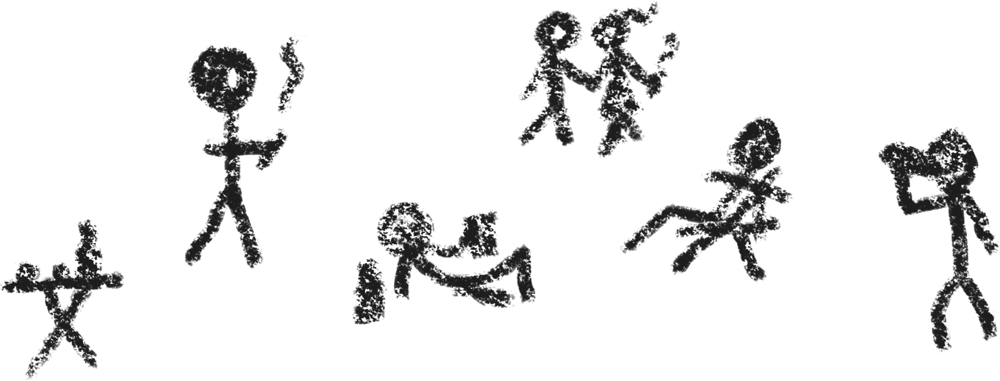

<!DOCTYPE html>
<html lang="es">
<head>
<meta charset="UTF-8">
<meta name="viewport" content="width=device-width, initial-scale=1.0">

</head>

<body>

    

    

<footer>
@@ ™ - All rights reserved.
</footer>

</body>
</html>
